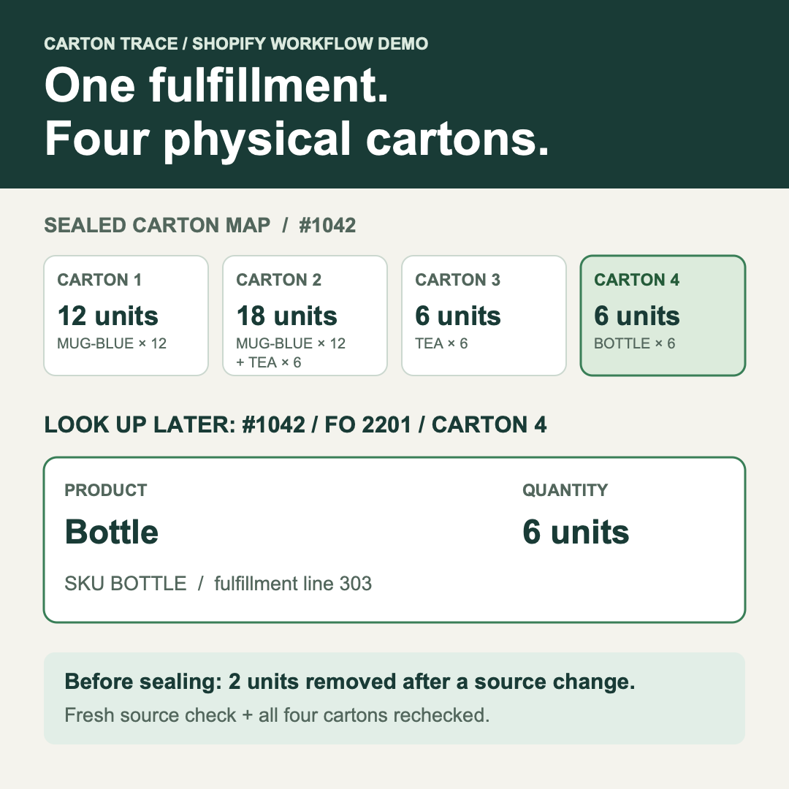

# Carton Trace

**Per-carton packing lists for a Shopify fulfillment order.**

A [small-business request](https://www.reddit.com/r/smallbusiness/comments/1ir81av/packing_list_app_for_shopify/) asked for a Shopify order to be split into boxes, with a printable list for each box and a way to retrieve a box's contents later. Carton Trace maps fulfillment lines to physical cartons and saves a sealed record keyed by Shopify order and fulfillment-order IDs. A later lookup returns one carton's exact contents. The workflow also compares a fresh source response before dispatch, produces per-carton slips, and exports a handoff that retains Shopify fulfillment-order line IDs.

The included query and `integration.js` provide the boundary for a Shopify app developer to supply an authenticated Admin GraphQL client. This repository does not include OAuth, an installed Shopify app, a live store connection, or a fulfillment mutation. The browser interface works with a saved GraphQL JSON response; the connector contract can fetch live data when embedded in an authorized app. See [Shopify integration](docs/shopify-integration.md).



## Try the workflow

Run `npm ci` and `npm run demo:packer`, then open the local URL it prints. Enter order ID `1042` and four cartons. The server loads a Shopify-shaped fixture through an injected query function; the packer desk lets you assign lines, print each carton slip, reconcile a changed quantity, record physical checks, seal, and search the saved record by order name and carton number. Reload the browser page and search `#1042`, carton `4` to verify that lookup does not depend on the open draft. To reopen the same local records after restarting the server, pass its printed directory to `npm run demo:packer -- /path/to/printed/directory`. This demo binds to `127.0.0.1` and has no Shopify credentials or production authentication.

`npm run demo:shopify` remains a repeatable command-line walkthrough. It injects a fixture-backed Admin query function, allocates one fulfillment to four cartons, reconciles a changed response, seals the record, then retrieves carton 4 through a new workflow instance. The command prints its fresh output directory; open `box-4-lookup.json` there for the result.

For the separate browser flow, open `index.html` in a desktop browser. In **Import Shopify order data**, choose `fixtures/shopify-order.json`. It contains a wholesale order with 44 shippable units and one digital line that is excluded. Record the actual carton contents, using Shopify fulfillment-order line IDs internally so repeated SKUs do not collapse together. The packing slips show the human SKU.

After packing, use **Compare a fresh Shopify GraphQL response** in the packing draft. The included `fixtures/shopify-order-changed.json` reduces bottles from eight to six. Carton Trace identifies the changed line and, after confirmation, removes the excess two units from the draft. Compare the changed response again, then check each physical carton before sealing. A later packing edit clears those checks. Download the sealed record, individual packing slips, and the Shopify handoff JSON. Reopen the saved record to inspect a specific dispatched carton.

Manual entry remains available for orders outside Shopify. The original sealed record stays separate from later edits to the draft.

## Developer seam

`shopify.js` exports `orderQuery`, `fromResponse`, `toDraft`, `changes`, `rebase`, and `manifest`. `integration.js` accepts a caller-provided `queryFn(query, variables)` and exposes `fetchSource` and `checkedHandoff`. `workflow.js` adds a host-side path from Shopify order ID to durable carton lookup: `start`, `assign`, `unassign`, `reconcile`, `acknowledgeRemoval`, `checkCarton`, `seal`, `findBox`, and `findBoxByOrderName`. `host-server.js` and `host-ui.html` show the packer interface; embed it behind your Shopify app's authentication and pass the order ID from the Admin context. Source changes and packing edits clear recorded carton checks. The host supplies authentication and storage. `file-store.js` is a local single-process example; replace it with a tenant-scoped, transactional database adapter for an installed app. The manifest is a handoff artifact, not a Shopify fulfillment mutation payload.

Run `npm run demo:shopify` to replay a constructed source change, save the sealed record, then reopen it in a fresh host instance. The fresh output directory includes `box-4-lookup.json`: order `#1042`, carton `4`, SKU `BOTTLE`, quantity `6`, and the Shopify fulfillment-order line ID. Demo files stay in ignored `build/`; no Shopify account or token is used.

Shopify [prints separate packing slips for separate shipments](https://help.shopify.com/en/manual/fulfillment/managing-orders/printing-orders/packing-slips/printing-packing-slips). This example addresses a narrower case: multiple physical cartons in one fulfillment, with a saved map of what the packer put in each carton. Whether a merchant needs that extra map depends on how they create shipments and track boxes. The repository is a developer reference, not an installed Shopify app.

The query selects one fulfillment order. If an order has multiple fulfillment orders, specify the fulfillment-order ID in the browser or in `fetchSource`. The importer refuses incomplete pagination, GraphQL errors, missing IDs, invalid quantities, and ambiguous fulfillment-order selection. It excludes non-shippable and already-fulfilled lines.

## Run checks

Node.js 22.13+:

```sh
npm ci
npm test
```

The tests cover core allocation, browser-interface behavior through a DOM model, Shopify source import and rebase, generated slips, and the injected connector contract. They do not establish operation in a live Shopify store or verify a physical carton. Source records and downloaded handoffs can contain order details; handle real merchant data according to the store's policies.

MIT license.
