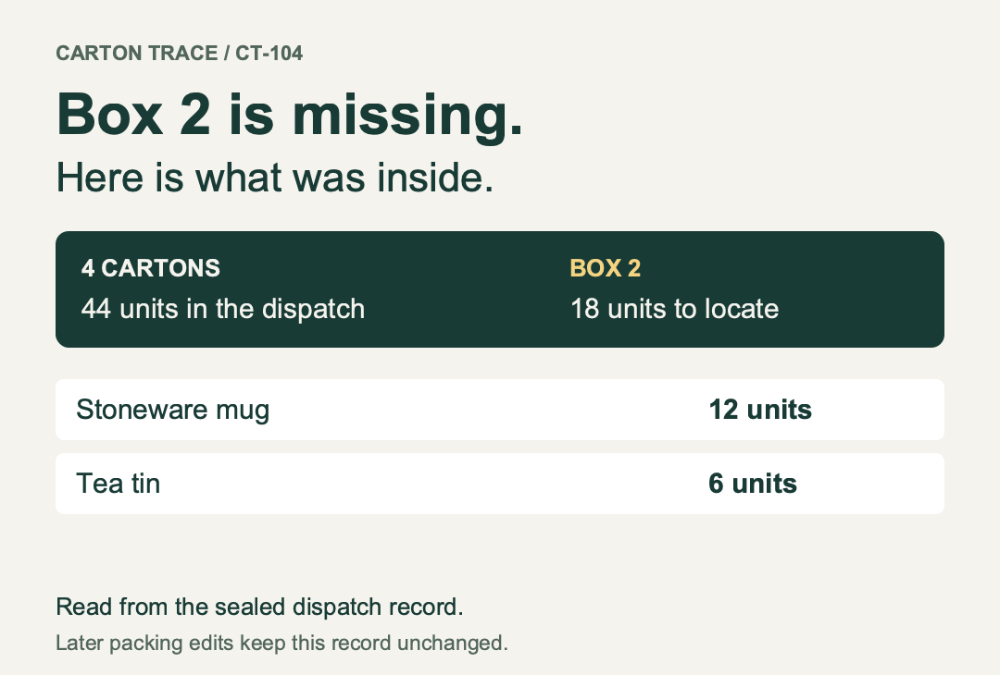

# Carton Trace

**A customer has box 1, 3 and 4. What was in box 2?**

Carton Trace records actual packed quantities by carton, reconciles them against the order, and saves a dispatch snapshot. Reopen the record to answer a missing-carton question without reconstructing the shipment from an order-wide product list.



## One order, four cartons

The included demonstration packs 24 mugs, 12 tea tins and 8 bottles across four cartons. Box 2 contains **12 mugs and 6 tea tins**. After sealing that dispatch, moving five mugs in the working draft leaves the dispatch record unchanged. The saved file retains both versions; packing slips use the sealed version.

This separates two useful answers: what the current packing draft says, and what the operator recorded at dispatch. The snapshot is an application safeguard, not cryptographic proof or evidence of a physical shipment.

## Use it

Download the repository and open `index.html` in a current desktop browser. It needs no installation, server or account. Alternatively, serve this directory with `python3 -m http.server 8769` and visit `http://localhost:8769`.

1. Enter an order reference, product lines (`SKU | product name | quantity`), and carton names separated by commas. **Try a packed order** opens the demonstration.
2. Record the quantities actually packed. Move quantities between cartons or return them to unpacked when plans change. Add a carton when needed; remove empty cartons after consolidation.
3. Check every carton against its physical contents. Sealing is available only when all ordered units are assigned and every listed carton has contents.
4. **Seal dispatch record**, confirm, then download the record file and packing slips. Print one slip per carton from the downloaded HTML.
5. Later, open the record file and select the missing carton. **View packing draft** lets you inspect or edit the separate working version.

Download each order before starting another. Browser storage is a convenience for one current record, not an archive. Use one active tab; simultaneous tabs do not coordinate changes.

## Useful difference

Shipping platforms and packing apps can provide integrated fulfillment, box selection and shipment documents. This tool focuses on a portable record of the actual contents of each carton: explicit assignment, a separate dispatch snapshot, and human-readable slips. It suits occasional manual packing when that narrower workflow is enough. It does not connect to Shopify, suggest box dimensions, create carrier labels or track a package.

## Reproduce the result

Node.js 22.13+:

```sh
node cli.js demo build/demo
node cli.js inspect build/demo/record.json 2
node cli.js slips build/demo/record.json build/slips.html
node cli.js visual build/demo/record.json build/missing-carton.svg 2
```

The commands have no runtime dependencies. The demo writes a portable JSON record, printable HTML and an SVG derived from the dispatch contents. All included values are invented demonstration inputs.

For core and DOM-model tests:

```sh
npm ci
npm test
```

DOM-model tests cover application handlers and persistence; they do not substitute for browser rendering, file picker or print-dialog checks.

## Design and limits

- Whole units only; up to 100 product lines, 50 cartons and 1,000,000 units per SKU. Identical SKU/name lines merge; conflicting product names for a SKU are rejected.
- Allocation and repacking return validated copies. A rejected move cannot deduct units from the source carton.
- Imports rebuild allocations against order quantities and reject overpacking, unknown cartons and invalid sealed records. Files must be under 2 MB.
- A sealed dispatch stays separate from later draft edits. It cannot be amended inside this version. If the actual shipment changes, download the existing record, choose **New order**, recreate the corrected packing plan, and seal and save that new record. Ordinary **Save record file** keeps the original dispatch; editing the draft does not correct it. Retain both files according to your process.
- No network requests or telemetry. Records remain in the browser or downloaded files. They are not encrypted; handle real customer records appropriately.
- The operator is responsible for accurate entry, physical checks and retaining the correct record. This is a packing aid, not an inventory or warehouse management system.

MIT license.
